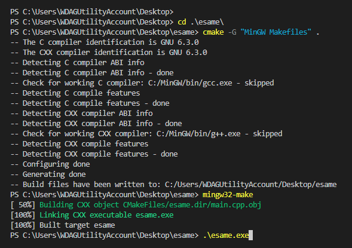

# Esame di Programmazione Avanzata e Parallela 2022-2023

Gruppo composto da: Vittorio Amoruso, Nicola Cortinovis, Erion Islamay e Nicola Zucchia

Implementazione sequenziale dell'algoritmo del Simplesso 

## Struttura della Repository

*  La cartella `examples` contiene 4 file sorgente per il testing dell'algoritmo del simplesso

    * `mainEQ.cpp`  (test per vincoli che presentano uguaglianze)
    * `mainINFEASIBLE.cpp` (test per un problema insoddisfacibile)
    * `mainMIN.cpp`  (test per un problema di minimizzazione)
    * `mainUNBOUND.cpp` (test per un problema illimitato)

* La cartella `include` contiene i seguenti file header

    * `LinearConstrainSystem.hpp` (struttura della classe)
    * `print_functions.hpp` (metodi per la stampa dei passaggi dell'algoritmo)
    * `simplex_functions.hpp` (metodi utilizzati dall'algoritmo)

* `CMakeLists.txt` file txt necessario per la compilazione tramite CMake

* `main.cpp` file sorgente per il testing di un problema di massimizzazione

## Prerequisiti

C++ | Ide a scelta

MinGW

Cmake

## How To build and execute

